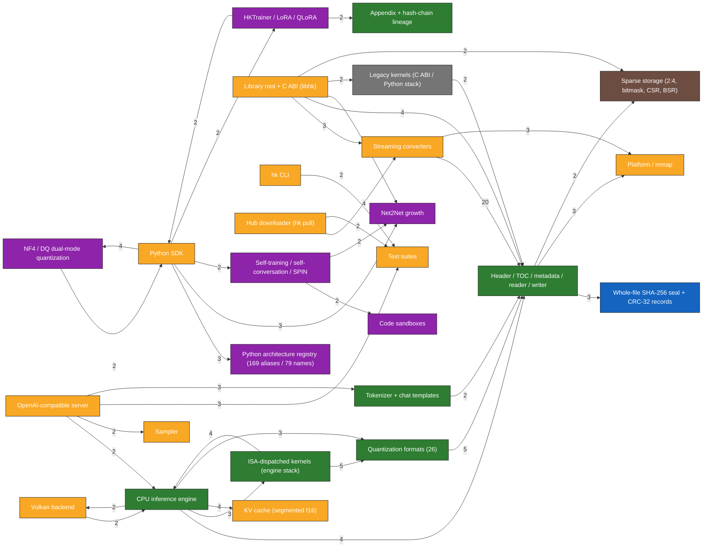

# HK knowledge graph

> **Generated by `docs/graph/gen_graph.py` — do not edit by hand.** Edit `curated.json` (concepts, status, plan links) and rerun.
> As of: 2026-10-06 (commit 43cf891 + uncommitted integrity/transaction work).

79 curated nodes, 153 curated edges, 167 source files, 368 import edges, 0 files not owned by any curated node.

## Using the graph

`graph.json` has `nodes` (types: root, system, subsystem, backend, planned, milestone, constraint, doc, file) and `edges`
(types: contains, depends_on, blocked_by, requires, constrains, supersedes, implemented_by, imports). Plan sections are in each node's `plan` field.

```bash
# everything the plan says about a section, and what implements it
jq '.nodes[] | select(.plan? // [] | index(57))' docs/graph/graph.json
# files behind a subsystem
jq -r '.edges[] | select(.s=="engine" and .type=="implemented_by") | .t' docs/graph/graph.json
# what is blocked by the backend abstraction
jq -r '.edges[] | select(.t=="backend-abstraction" and .type=="blocked_by") | .s' docs/graph/graph.json
# all not-started items
jq -r '.nodes[] | select(.status=="not-started") | .id' docs/graph/graph.json
# which curated subsystems import which (measured, not curated)
jq -r '.coupling[] | "\(.s) -> \(.t) (\(.imports))"' docs/graph/graph.json
```

Status legend: `done`, `partial`, `in-progress`, `prototype`, `storage-only`, `legacy`, `untested-hw`, `not-started`. Meanings are in `docs/plan/STATUS.md`.

Status counts (subsystems, backends, planned, docs): done 8, partial 14, in-progress 2, prototype 8, storage-only 1, legacy 2, not-started 24.

## 1. System map (colored by status)


## 2a. What exists: dependencies between built subsystems

Solid arrow = depends on; double arrow = independent path that does not share runtime code with its target.

```mermaid
flowchart BT
  n_appendix_lineage["Appendix + hash-chain lineage"]:::done
  n_architecture_registry["Python architecture registry (169 aliases / 79 names)"]:::prototype
  n_backend_cuda_standalone["CUDA (standalone, not in engine)"]:::legacy
  n_backend_vulkan["Vulkan backend"]:::partial
  n_bindings["Language bindings"]:::partial
  n_c_abi["Library root + C ABI (libhk)"]:::partial
  n_cli["hk CLI"]:::partial
  n_code_sandbox["Code sandboxes"]:::prototype
  n_converters["Streaming converters"]:::partial
  n_engine["CPU inference engine"]:::done
  n_format_core["Header / TOC / metadata / reader / writer"]:::done
  n_growth["Net2Net growth"]:::prototype
  n_hub_pull["Hub downloader (hk pull)"]:::partial
  n_integrity["Whole-file SHA-256 seal + CRC-32 records"]:::in_progress
  n_kernels_engine["ISA-dispatched kernels (engine stack)"]:::done
  n_kernels_legacy["Legacy kernels (C ABI / Python stack)"]:::legacy
  n_kv_cache["KV cache (segmented f16)"]:::partial
  n_platform_mmap["Platform / mmap"]:::partial
  n_pruning["Pruning"]:::prototype
  n_python_sdk["Python SDK"]:::partial
  n_quant_formats["Quantization formats (26)"]:::done
  n_sampler["Sampler"]:::partial
  n_self_training["Self-training / self-conversation / SPIN"]:::prototype
  n_server["OpenAI-compatible server"]:::partial
  n_sparsity_storage["Sparse storage (2:4, bitmask, CSR, BSR)"]:::storage_only
  n_tokenizer["Tokenizer + chat templates"]:::done
  n_trainer["HKTrainer / LoRA / QLoRA"]:::prototype
  n_transaction["Metadata edit journal / hk repair"]:::in_progress
  n_engine --> n_kernels_engine
  n_engine --> n_quant_formats
  n_engine --> n_kv_cache
  n_engine --> n_format_core
  n_engine --> n_backend_vulkan
  n_engine --> n_platform_mmap
  n_server --> n_engine
  n_server --> n_sampler
  n_server --> n_tokenizer
  n_cli --> n_engine
  n_cli --> n_hub_pull
  n_cli --> n_converters
  n_cli --> n_appendix_lineage
  n_cli --> n_integrity
  n_hub_pull --> n_converters
  n_converters --> n_format_core
  n_converters --> n_quant_formats
  n_format_core --> n_platform_mmap
  n_integrity --> n_format_core
  n_integrity --> n_platform_mmap
  n_transaction --> n_integrity
  n_transaction --> n_format_core
  n_appendix_lineage --> n_integrity
  n_c_abi --> n_kernels_legacy
  n_c_abi --> n_format_core
  n_c_abi --> n_engine
  n_bindings --> n_c_abi
  n_python_sdk --> n_c_abi
  n_architecture_registry --> n_converters
  n_growth --> n_format_core
  n_growth --> n_python_sdk
  n_trainer --> n_python_sdk
  n_self_training --> n_trainer
  n_self_training --> n_code_sandbox
  n_self_training --> n_appendix_lineage
  n_pruning --> n_sparsity_storage
  n_backend_cuda_standalone ==> n_kernels_legacy
  classDef done fill:#2e7d32,stroke:#222,color:#fff;
  classDef partial fill:#f9a825,stroke:#222,color:#fff;
  classDef in_progress fill:#1565c0,stroke:#222,color:#fff;
  classDef prototype fill:#8e24aa,stroke:#222,color:#fff;
  classDef storage_only fill:#6d4c41,stroke:#222,color:#fff;
  classDef legacy fill:#757575,stroke:#222,color:#fff;
  classDef untested_hw fill:#ef6c00,stroke:#222,color:#fff;
  classDef not_started fill:#c62828,stroke:#222,color:#fff;
```



## 2b. What is planned, and what gates it

Dashed arrow = blocked by (the planned item cannot start until its target exists); solid = depends on.

```mermaid
flowchart BT
  n_appendix_lineage["Appendix + hash-chain lineage"]:::done
  n_arch_descriptor["ArchitectureDescriptor/Parser/Validator/Executor"]:::not_started
  n_backend_abstraction["Backend abstraction (Backend interface)"]:::not_started
  n_backend_cuda_engine["CUDA engine backend (Tensor Cores, graphs)"]:::not_started
  n_backend_cuda_standalone["CUDA (standalone, not in engine)"]:::legacy
  n_backend_directml_xpu["DirectML / D3D12 / Intel XPU"]:::not_started
  n_backend_metal["Metal backend"]:::not_started
  n_backend_npu["NPU backends (QNN, CoreML, NNAPI, OpenVINO)"]:::not_started
  n_backend_rocm["ROCm / HIP backend"]:::not_started
  n_c_abi["Library root + C ABI (libhk)"]:::partial
  n_continuous_batching["Continuous batching + paged KV + prefix cache"]:::not_started
  n_distributed["Multi-GPU / distributed inference + training"]:::not_started
  n_dual_mode_runtime["Dual-mode quant runtime + auto mixed precision"]:::not_started
  n_engine["CPU inference engine"]:::done
  n_extension_system["Plugin / extension system + stable ABI v1"]:::not_started
  n_format_core["Header / TOC / metadata / reader / writer"]:::done
  n_fuzzing["Fuzzing + malicious-file corpus"]:::not_started
  n_graph_ir["Graph runtime / HK IR / fusion / liveness"]:::not_started
  n_growth["Net2Net growth"]:::prototype
  n_integrity["Whole-file SHA-256 seal + CRC-32 records"]:::in_progress
  n_kv_cache["KV cache (segmented f16)"]:::partial
  n_lineage_vcs["Branching/merging/deltas/adapter execution"]:::not_started
  n_memory_planner["Unified memory planner + partial offload"]:::not_started
  n_mobile_runtime["Android / iOS runtime + SDKs"]:::not_started
  n_model_evolution["Model-evolution loop + architecture search"]:::not_started
  n_moe_ssm_multimodal["MoE, SSM (Mamba), sliding-window, multimodal"]:::not_started
  n_nf4_dq["NF4 / DQ dual-mode quantization"]:::prototype
  n_op_capability_table["Operator capability system + tiered fallback"]:::not_started
  n_profiling_autotune["hk profile + autotuning + persistent kernel cache"]:::not_started
  n_sampler["Sampler"]:::partial
  n_self_training["Self-training / self-conversation / SPIN"]:::prototype
  n_server["OpenAI-compatible server"]:::partial
  n_signatures_registry["Signatures, trusted publishers, model registry"]:::not_started
  n_sparse_execution["Sparse execution (2:4, Tensor Core sparse)"]:::not_started
  n_sparsity_storage["Sparse storage (2:4, bitmask, CSR, BSR)"]:::storage_only
  n_speculative_grammar["Speculative decoding + grammar/structured output"]:::not_started
  n_wasm_webgpu["WASM / WebGPU runtime"]:::not_started
  n_backend_abstraction -.-> n_engine
  n_op_capability_table -.-> n_backend_abstraction
  n_graph_ir -.-> n_backend_abstraction
  n_memory_planner -.-> n_backend_abstraction
  n_backend_cuda_engine -.-> n_backend_abstraction
  n_backend_cuda_engine --> n_backend_cuda_standalone
  n_backend_metal -.-> n_backend_abstraction
  n_backend_rocm -.-> n_backend_abstraction
  n_backend_npu -.-> n_backend_abstraction
  n_backend_directml_xpu -.-> n_backend_abstraction
  n_mobile_runtime -.-> n_backend_npu
  n_mobile_runtime --> n_c_abi
  n_wasm_webgpu -.-> n_backend_abstraction
  n_arch_descriptor -.-> n_engine
  n_moe_ssm_multimodal -.-> n_arch_descriptor
  n_continuous_batching -.-> n_kv_cache
  n_continuous_batching -.-> n_server
  n_speculative_grammar -.-> n_sampler
  n_speculative_grammar -.-> n_continuous_batching
  n_sparse_execution -.-> n_sparsity_storage
  n_sparse_execution -.-> n_backend_abstraction
  n_dual_mode_runtime -.-> n_nf4_dq
  n_dual_mode_runtime -.-> n_engine
  n_signatures_registry -.-> n_integrity
  n_lineage_vcs -.-> n_appendix_lineage
  n_lineage_vcs -.-> n_signatures_registry
  n_distributed -.-> n_memory_planner
  n_distributed -.-> n_continuous_batching
  n_profiling_autotune -.-> n_backend_abstraction
  n_fuzzing -.-> n_format_core
  n_model_evolution -.-> n_self_training
  n_model_evolution -.-> n_growth
  n_model_evolution -.-> n_lineage_vcs
  n_extension_system -.-> n_backend_abstraction
  n_extension_system -.-> n_c_abi
  classDef done fill:#2e7d32,stroke:#222,color:#fff;
  classDef partial fill:#f9a825,stroke:#222,color:#fff;
  classDef in_progress fill:#1565c0,stroke:#222,color:#fff;
  classDef prototype fill:#8e24aa,stroke:#222,color:#fff;
  classDef storage_only fill:#6d4c41,stroke:#222,color:#fff;
  classDef legacy fill:#757575,stroke:#222,color:#fff;
  classDef untested_hw fill:#ef6c00,stroke:#222,color:#fff;
  classDef not_started fill:#c62828,stroke:#222,color:#fff;
```



## 3. Milestones and what they require

```mermaid
flowchart TB
  n_arch_descriptor["ArchitectureDescriptor/Parser/Validator/Executor"]:::not_started
  n_backend_abstraction["Backend abstraction (Backend interface)"]:::not_started
  n_backend_cuda_engine["CUDA engine backend (Tensor Cores, graphs)"]:::not_started
  n_backend_directml_xpu["DirectML / D3D12 / Intel XPU"]:::not_started
  n_backend_metal["Metal backend"]:::not_started
  n_backend_npu["NPU backends (QNN, CoreML, NNAPI, OpenVINO)"]:::not_started
  n_backend_rocm["ROCm / HIP backend"]:::not_started
  n_backend_vulkan["Vulkan backend"]:::partial
  n_code_sandbox["Code sandboxes"]:::prototype
  n_continuous_batching["Continuous batching + paged KV + prefix cache"]:::not_started
  n_distributed["Multi-GPU / distributed inference + training"]:::not_started
  n_dual_mode_runtime["Dual-mode quant runtime + auto mixed precision"]:::not_started
  n_growth["Net2Net growth"]:::prototype
  n_integrity["Whole-file SHA-256 seal + CRC-32 records"]:::in_progress
  n_lineage_vcs["Branching/merging/deltas/adapter execution"]:::not_started
  n_memory_planner["Unified memory planner + partial offload"]:::not_started
  n_mobile_runtime["Android / iOS runtime + SDKs"]:::not_started
  n_model_evolution["Model-evolution loop + architecture search"]:::not_started
  n_moe_ssm_multimodal["MoE, SSM (Mamba), sliding-window, multimodal"]:::not_started
  n_ms_2_0["HK 2.0 Unified Runtime"]:::partial
  n_ms_2_1["HK 2.1 Hardware Acceleration"]:::not_started
  n_ms_2_2["HK 2.2 Model Compatibility"]:::partial
  n_ms_2_3["HK 2.3 Server Runtime"]:::partial
  n_ms_2_4["HK 2.4 Universal Format"]:::in_progress
  n_ms_2_5["HK 2.5 Training Platform"]:::prototype
  n_ms_2_6["HK 2.6 Adaptive Research"]:::prototype
  n_ms_2_7["HK 2.7 Self-Improvement"]:::prototype
  n_ms_3_0["HK 3.0 Universal Neural Runtime"]:::not_started
  n_pruning["Pruning"]:::prototype
  n_self_training["Self-training / self-conversation / SPIN"]:::prototype
  n_signatures_registry["Signatures, trusted publishers, model registry"]:::not_started
  n_sparse_execution["Sparse execution (2:4, Tensor Core sparse)"]:::not_started
  n_speculative_grammar["Speculative decoding + grammar/structured output"]:::not_started
  n_trainer["HKTrainer / LoRA / QLoRA"]:::prototype
  n_transaction["Metadata edit journal / hk repair"]:::in_progress
  n_wasm_webgpu["WASM / WebGPU runtime"]:::not_started
  n_ms_2_0 --> n_backend_abstraction
  n_ms_2_0 --> n_backend_cuda_engine
  n_ms_2_0 --> n_memory_planner
  n_ms_2_0 --> n_backend_vulkan
  n_ms_2_1 --> n_backend_cuda_engine
  n_ms_2_1 --> n_sparse_execution
  n_ms_2_1 --> n_backend_rocm
  n_ms_2_1 --> n_backend_metal
  n_ms_2_1 --> n_backend_directml_xpu
  n_ms_2_2 --> n_arch_descriptor
  n_ms_2_2 --> n_moe_ssm_multimodal
  n_ms_2_3 --> n_continuous_batching
  n_ms_2_3 --> n_speculative_grammar
  n_ms_2_3 --> n_distributed
  n_ms_2_4 --> n_integrity
  n_ms_2_4 --> n_transaction
  n_ms_2_4 --> n_signatures_registry
  n_ms_2_5 --> n_trainer
  n_ms_2_5 --> n_pruning
  n_ms_2_5 --> n_dual_mode_runtime
  n_ms_2_6 --> n_growth
  n_ms_2_6 --> n_lineage_vcs
  n_ms_2_6 --> n_model_evolution
  n_ms_2_7 --> n_self_training
  n_ms_2_7 --> n_code_sandbox
  n_ms_3_0 --> n_mobile_runtime
  n_ms_3_0 --> n_wasm_webgpu
  n_ms_3_0 --> n_backend_npu
  n_ms_3_0 --> n_ms_2_0
  n_ms_3_0 --> n_ms_2_1
  n_ms_3_0 --> n_ms_2_2
  n_ms_3_0 --> n_ms_2_3
  classDef done fill:#2e7d32,stroke:#222,color:#fff;
  classDef partial fill:#f9a825,stroke:#222,color:#fff;
  classDef in_progress fill:#1565c0,stroke:#222,color:#fff;
  classDef prototype fill:#8e24aa,stroke:#222,color:#fff;
  classDef storage_only fill:#6d4c41,stroke:#222,color:#fff;
  classDef legacy fill:#757575,stroke:#222,color:#fff;
  classDef untested_hw fill:#ef6c00,stroke:#222,color:#fff;
  classDef not_started fill:#c62828,stroke:#222,color:#fff;
```



## 4. Measured coupling (source imports aggregated per curated subsystem)

Counts are file-level import edges from `@import("x.zig")` and Python relative imports. Edges to or from `src/root.zig`
(the library's re-export hub, which tests and tools import as `hk`) are excluded: it touches every module and would hide the real structure.
The diagram shows only pairs with at least 2 imports; every pair (including single imports) is in `graph.json` under `coupling`.



## 5. Node index

### Systems

| id | label | status | plan § | files | LOC | note |
|:--|:--|:--|:--|--:|--:|:--|
| `container` | Container (.hk format) | partial | 3, 4, 5, 6, 7, 8 | — | — | Universal model representation. |
| `runtime` | Runtime (inference) | partial | 9, 56, 57, 76, 77 | — | — | Fast memory-efficient inference; today CPU + Vulkan on Linux, 3 architecture families. |
| `research` | Research stack | prototype | 22, 28, 32, 105 | — | — | Quantization, sparsity, growth, lineage, self-training. Python prototypes, small-model tests only. |
| `tooling` | Tooling | partial | 91, 93, 124 | — | — | Conversion, serving, SDKs, benchmarks, packaging. |

### Subsystems

| id | label | status | plan § | files | LOC | note |
|:--|:--|:--|:--|--:|--:|:--|
| `format-core` | Header / TOC / metadata / reader / writer | done | 3, 4 | 7 | 2210 | 128-byte header, aligned payloads, v1. Reader bounds hardening is uncommitted. arrays.zig holds compact in-place array values for metadata (e.g. 150k-token vocabularies). |
| `integrity` | Whole-file SHA-256 seal + CRC-32 records | in-progress | 4 | 1 | 77 | Uncommitted. Re-hashes whole file per mutation (O(file) time). No signatures. |
| `transaction` | Metadata edit journal / hk repair | in-progress | 5 | 1 | 89 | Uncommitted. Metadata prefix only; appendix and full writes not atomic; no compact/fsck. |
| `appendix-lineage` | Appendix + hash-chain lineage | done | 37 | 2 | 616 | Linear chain, rollback. No signatures/branching/merging. Engine ignores appendix records. |
| `platform-mmap` | Platform / mmap | partial | 7, 8 | 1 | 432 | POSIX mmap done; Windows mapping unrun; no huge pages / NUMA / madvise. |
| `quant-formats` | Quantization formats (26) | done | 3, 21 | 9 | 3277 | Decoder + vecdot + batch kernel for each; reference-tested. DQ*/NF4 are storage + Python only. |
| `sparsity-storage` | Sparse storage (2:4, bitmask, CSR, BSR) | storage-only | 26, 27 | 2 | 370 | Reader decodes to f32; no sparse kernels in the engine. |
| `nf4-dq` | NF4 / DQ dual-mode quantization | prototype | 22, 23 | 2 | 803 | Quantize/dequantize pairs; no runtime residual policy; engine refuses. |
| `engine` | CPU inference engine | done | 1, 9, 16, 46 | 11 | 2633 | Dense decoder, GQA, RMSNorm, gated MLP; Arch enum has 3 values. Weights are views of the mapped file. |
| `kernels-engine` | ISA-dispatched kernels (engine stack) | done | 9, 10, 11, 14 | 4 | 336 | x86: avx512/avx2vnni/avx2/generic. ARM: dotprod/neon (never run on ARM). |
| `kernels-legacy` | Legacy kernels (C ABI / Python stack) | legacy | 9, 15, 17, 20 | 2 | 2469 | Holds v1.1.0 gemmF32 zero-skip, RoPE table, FP8 LUT. Not used by the engine. |
| `kv-cache` | KV cache (segmented f16) | partial | 80, 50 | 1 | 143 | 256-position segments, tiled keys. No paging/quant/compression/eviction. |
| `sampler` | Sampler | partial | 52 | 1 | 299 | greedy/temp/top-k/top-p/min-p/penalties/logit-bias. No typical/mirostat/custom/GPU. |
| `tokenizer` | Tokenizer + chat templates | done | 53, 99 | 7 | 4431 | BPE + SentencePiece; Jinja subset; checked vs llama.cpp on 301,948 tokens. |
| `server` | OpenAI-compatible server | partial | 77, 78, 79, 125 | 4 | 1588 | chat/completions, completions, models, health, metrics, SSE, API key, slots. No embeddings/rerank/WebSocket/HTTP2/rate limits. |
| `c-abi` | Library root + C ABI (libhk) | partial | 147 | 4 | 2074 | ~133 exports; no ABI version / struct-size / capability discovery. |
| `hub-pull` | Hub downloader (hk pull) | partial | 93 | 7 | 2096 | Resume, retries, SHA-256; GGUF + sharded safetensors. No split-GGUF, parallel, S3, registry. |
| `converters` | Streaming converters | partial | 90, 95 | 10 | 3138 | GGUF/safetensors/HF → .hk streaming; .hk → safetensors/GGUF. BPE-only tokenizer.json import. |
| `cli` | hk CLI | partial | 124 | 3 | 2321 | ~30 commands; missing quantize/compact/fsck/history/diff/merge/sign/profile/distributed. |
| `bench-tools` | Benchmarks (hk-compare, hk-kernels) | partial | 85, 84 | 3 | 835 | Reproducible vs llama.cpp only. |
| `bindings` | Language bindings | partial | 91 | — | — | C, C++, Rust, Go, C#, Java, TypeScript tested. Kotlin/Swift/ObjC absent. |
| `python-sdk` | Python SDK | partial | 87, 88, 89 | 21 | 10774 | Native engine/tokenizer wrappers + torch integration. No DLPack; NativeHKTensor/Model/Trainer absent. |
| `architecture-registry` | Python architecture registry (169 aliases / 79 names) | prototype | 46, 47 | 1 | 315 | Conversion/tensor-name mapping only. NOT engine support. |
| `gui` | Model editor GUI | prototype | 97 | 2 | 698 |  |
| `ci` | CI | partial | 138 | — | — | Zig tests on 3 OSes, forced-ISA runs, cross-compile matrix, Python matrix, bindings. No GPU/ARM/mobile hardware. |
| `growth` | Net2Net growth | prototype | 28, 29, 30, 31 | 6 | 1357 | Wider SwiGLU/linear + vocab; deeper only in Python (linear). Small-model tests. |
| `pruning` | Pruning | prototype | 25 | 1 | 343 | Magnitude, Wanda, structured L2, block, 2:4, recovery fine-tune. |
| `trainer` | HKTrainer / LoRA / QLoRA | prototype | 40, 41 | 2 | 618 | PyTorch-based; no native/distributed trainer; engine can't apply adapters. |
| `self-training` | Self-training / self-conversation / SPIN | prototype | 32, 34, 35 | 2 | 469 | Components, not a validated loop. No demonstrated improvement. |
| `code-sandbox` | Code sandboxes | prototype | 33 | 2 | 355 | PLAN VIOLATION: Docker mode silently degrades to unsandboxed subprocess; Zig NativeSandbox does not enforce its timeout and is unused. |
| `tests-suite` | Test suites | partial | 102, 103, 104, 138 | 24 | 7176 | Zig unit/e2e suites, pytest, bindings runner. Reference tests: gguf package (quant decoders), HF Transformers (logits), llama.cpp (perplexity, tokenizer). No MMLU/code/math/long-context suites; no fuzzing. |
| `dev-tools` | Dev tools (generators, probes, HF Space app) | done | 84 | 5 | 996 | Quant fixture/table and Unicode table generators, hk-probe, SPIR-V extraction helper, HF Space demo. |

### Backends

| id | label | status | plan § | files | LOC | note |
|:--|:--|:--|:--|--:|--:|:--|
| `backend-vulkan` | Vulkan backend | partial | 60, 72 | 14 | 3356 | Whole model on one device; one NVIDIA card tested; slower than llama.cpp Vulkan; no coop matrices. |
| `backend-cuda-standalone` | CUDA (standalone, not in engine) | legacy | 57 | 5 | 2502 | Driver-API wrapper + embedded PTX; only bench and its own tests use it. |

### Planned (no code yet)

| id | label | status | plan § | files | LOC | note |
|:--|:--|:--|:--|--:|--:|:--|
| `backend-abstraction` | Backend abstraction (Backend interface) | not-started | 1, 131, 132, 136, 137 | — | — | Gate for CUDA/Metal/ROCm. engine/model.zig calls the Vulkan engine directly today. |
| `op-capability-table` | Operator capability system + tiered fallback | not-started | 136, 137 | — | — |  |
| `graph-ir` | Graph runtime / HK IR / fusion / liveness | not-started | 131, 132, 133, 134, 135 | — | — | Forward pass is hand-written; fusion is manual. No zgc code exists despite a commit message. |
| `memory-planner` | Unified memory planner + partial offload | not-started | 1, 73, 134 | — | — | Python offload.py is a torch-based planner only. |
| `backend-cuda-engine` | CUDA engine backend (Tensor Cores, graphs) | not-started | 57, 150 | — | — |  |
| `backend-metal` | Metal backend | not-started | 59, 66 | — | — | Needs Apple hardware. |
| `backend-rocm` | ROCm / HIP backend | not-started | 58 | — | — |  |
| `backend-npu` | NPU backends (QNN, CoreML, NNAPI, OpenVINO) | not-started | 62, 63, 64, 65 | — | — |  |
| `backend-directml-xpu` | DirectML / D3D12 / Intel XPU | not-started | 61, 62 | — | — |  |
| `mobile-runtime` | Android / iOS runtime + SDKs | not-started | 64, 65, 119, 121, 122 | — | — | Java JNI glue exists but is not an Android package. |
| `wasm-webgpu` | WASM / WebGPU runtime | not-started | 70 | — | — |  |
| `arch-descriptor` | ArchitectureDescriptor/Parser/Validator/Executor | not-started | 46, 47 | — | — | Replaces the 3-value Arch enum; needed for Gemma/Phi/MoE/SSM. |
| `moe-ssm-multimodal` | MoE, SSM (Mamba), sliding-window, multimodal | not-started | 48, 49, 54, 55 | — | — |  |
| `continuous-batching` | Continuous batching + paged KV + prefix cache | not-started | 78, 79, 80 | — | — | Slot scheduler and shared prompt cache exist. |
| `speculative-grammar` | Speculative decoding + grammar/structured output | not-started | 51, 53 | — | — |  |
| `sparse-execution` | Sparse execution (2:4, Tensor Core sparse) | not-started | 26, 27 | — | — |  |
| `dual-mode-runtime` | Dual-mode quant runtime + auto mixed precision | not-started | 23, 24 | — | — | `hk quantize` does not exist. |
| `signatures-registry` | Signatures, trusted publishers, model registry | not-started | 4, 37, 94 | — | — |  |
| `lineage-vcs` | Branching/merging/deltas/adapter execution | not-started | 37, 38, 39, 40 | — | — |  |
| `distributed` | Multi-GPU / distributed inference + training | not-started | 74, 75, 115 | — | — |  |
| `profiling-autotune` | hk profile + autotuning + persistent kernel cache | not-started | 83, 84, 142 | — | — |  |
| `fuzzing` | Fuzzing + malicious-file corpus | not-started | 100, 101 | — | — | Only Zig's scaffold fuzz example exists. |
| `model-evolution` | Model-evolution loop + architecture search | not-started | 112, 113, 114, 155 | — | — |  |
| `extension-system` | Plugin / extension system + stable ABI v1 | not-started | 146, 147 | — | — |  |

### Milestones

| id | label | status | plan § | files | LOC | note |
|:--|:--|:--|:--|--:|--:|:--|
| `ms-2.0` | HK 2.0 Unified Runtime | partial | 150 | — | — |  |
| `ms-2.1` | HK 2.1 Hardware Acceleration | not-started | 150 | — | — |  |
| `ms-2.2` | HK 2.2 Model Compatibility | partial | 150 | — | — |  |
| `ms-2.3` | HK 2.3 Server Runtime | partial | 150 | — | — |  |
| `ms-2.4` | HK 2.4 Universal Format | in-progress | 150 | — | — |  |
| `ms-2.5` | HK 2.5 Training Platform | prototype | 150 | — | — |  |
| `ms-2.6` | HK 2.6 Adaptive Research | prototype | 150 | — | — |  |
| `ms-2.7` | HK 2.7 Self-Improvement | prototype | 150 | — | — |  |
| `ms-3.0` | HK 3.0 Universal Neural Runtime | not-started | 150 | — | — |  |

### Standing constraints

| id | label | status | plan § | files | LOC | note |
|:--|:--|:--|:--|--:|--:|:--|
| `rule-memory` | Memory efficiency is the product | done | 1, 154 | — | — | Stream, mmap, bounded buffers, measure peak RSS, flag O(model) paths. Owner rule. |
| `rule-robust` | Robustness: no silent failure; tests must bite | done | 100, 158 | — | — | Flag or blank instead of guessing; mutation-check guards; state limits honestly. Owner rule. |
| `rule-truthful-docs` | Docs state only what was run | done | 148 | — | — | 1.1.1 removed overstated claims; do not reintroduce. |
| `rule-benchmark` | No 'faster' without a benchmark | done | 1, 85 | — | — | Plan §1.5. |
| `rule-hierarchy` | Quality > correctness > memory/IO > compute > accel > distributed > research | done | 158 | — | — |  |
| `rule-zig-016` | Zig 0.16 (std.Io), per-ISA kernel builds | done | — | — | — | minimum_zig_version 0.16.0. |

### Docs

| id | label | status | plan § | files | LOC | note |
|:--|:--|:--|:--|--:|--:|:--|
| `docs-wiki` | User wiki | done | 145 | — | — | Rewritten in 1.1.1 against the code; auto-synced to GitHub wiki. |

## 6. Files not owned by any curated node

None.

